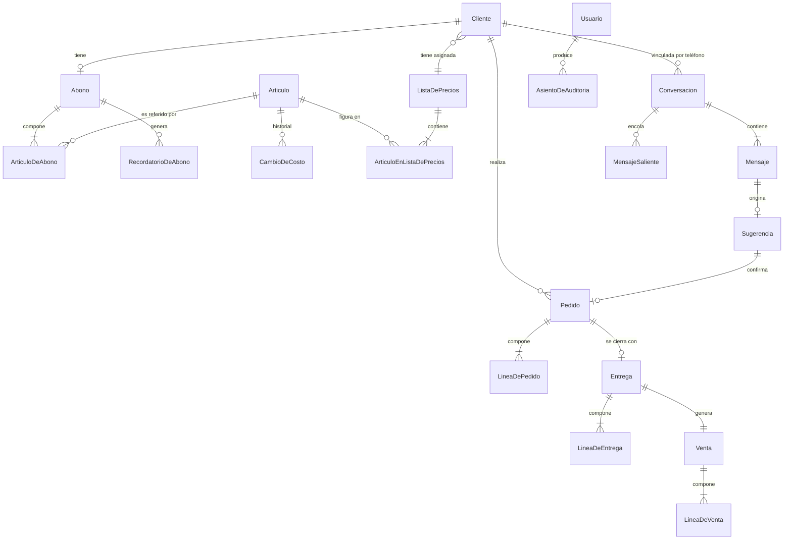

# Fase 1 — Modelo de Datos

**Funcionalidad**: Fase 1 — Fuente de verdad única y captura de pedidos
**Fecha**: 2026-07-29
**Base**: PostgreSQL 17, EF Core 10. Nombres de tabla y columna en `snake_case`, entidades en
español según `AGENTS.md`.

## Convenciones que aplican a todo el modelo

- **Clave primaria**: `Guid` generado en memoria con `Guid.CreateVersion7()`. Nunca identidad de
  la base — el interceptor de auditoría necesita la clave antes del `SaveChanges`.
- **`IAuditable`**: toda entidad con datos económicos lo implementa. El interceptor escribe su
  asiento dentro del mismo `SaveChanges`. Marcadas con **A** en las tablas de abajo.
- **Concurrencia**: `xmin` como token de concurrencia en toda entidad editable *(R-05)*.
- **Sin borrado físico**: las entidades con historial económico se dan de baja lógicamente
  *(FR-059)*. Ninguna tiene endpoint de `DELETE`.
- **Instantes**: `timestamptz`, siempre en UTC. La zona de negocio *(R-03)* se aplica al calcular
  días de aviso, fin de mes y períodos.
- **Dinero y cantidades**: `numeric(18,2)` y `numeric(18,3)` respectivamente *(R-04)*.

---

## Catálogo y precios

### Articulo **(A)**

| Campo | Tipo | Reglas |
|---|---|---|
| `id` | uuid v7 | PK |
| `nombre` | text | requerido |
| `tipo` | enum | `capsulas` \| `cafe_molido` \| `cafe_en_grano` *(FR-011)* |
| `presentacion` | text | requerido |
| `unidad_de_medida` | enum | `kilogramo` \| `unidad` — determina si admite decimales *(FR-014, FR-016a)* |
| `costo_vigente` | numeric(18,2) | ≥ 0 |
| `utilidad_por_defecto` | numeric(18,2) | porcentaje; se copia a las listas al alta *(FR-011, FR-015a)* |
| `activo` | boolean | la baja es lógica *(FR-013)* |

### CambioDeCosto **(A)**

Historial de FR-022. Se escribe tanto en la carga individual *(FR-019)* como en cada artículo
afectado por la actualización masiva *(FR-018)*.

| Campo | Tipo | Reglas |
|---|---|---|
| `id` | uuid v7 | PK |
| `articulo_id` | uuid | FK → Articulo |
| `costo_anterior` / `costo_nuevo` | numeric(18,2) | |
| `fecha` | timestamptz | |
| `usuario_id` | uuid | FK → Usuario |

### ListaDePrecios **(A)**

`id`, `nombre` (requerido, único entre activas), `activa`.

### ArticuloEnListaDePrecios **(A)**

| Campo | Tipo | Reglas |
|---|---|---|
| `id` | uuid v7 | PK |
| `lista_de_precios_id` | uuid | FK |
| `articulo_id` | uuid | FK |
| `porcentaje_de_utilidad` | numeric(18,2) | |

**Único** `(lista_de_precios_id, articulo_id)`. **Invariante**: existe una fila por cada artículo
activo en cada lista activa *(FR-015, FR-015a)*. El precio de venta **no se persiste**: se calcula
como `redondear(costo_vigente × (1 + utilidad/100), 2)` al leer *(R-10, FR-016)*.

---

## Clientes y abonos

### Cliente **(A)**

| Campo | Tipo | Reglas |
|---|---|---|
| `id` | uuid v7 | PK |
| `razon_social` | text | requerido |
| `tipo_documento` | enum | `cuit` \| `dni` |
| `numero_documento` | text | **único entre activos** *(aclaración 2026-07-29)* |
| `condicion_iva` | enum | `responsable_inscripto` \| `monotributista` \| `consumidor_final` |
| `telefono_whatsapp` | text | **puede repetirse** entre clientes *(FR-001)* |
| `direccion_de_entrega` | text | requerido |
| `email_general`, `email_facturacion`, `email_cobranzas` | text | los tres requeridos; admiten el mismo valor *(FR-004)* |
| `lista_de_precios_id` | uuid | FK, requerido para poder generar ventas *(FR-005)* |
| `forma_de_pago_por_defecto` | enum | `transferencia` \| `cheque` \| `efectivo` *(FR-006)* |
| `es_cliente_de_mostrador` | boolean | exactamente uno por instancia *(FR-010)* |
| `activo` | boolean | baja lógica *(FR-003)*; el borrado físico está impedido *(FR-009)* |

### Abono **(A)**

| Campo | Tipo | Reglas |
|---|---|---|
| `id` | uuid v7 | PK |
| `cliente_id` | uuid | FK; **único entre vigentes** |
| `fecha_de_inicio` | date | por defecto hoy *(FR-007)* |
| `dia_de_aviso` | smallint | 1–31; por defecto el día de la fecha de inicio |
| `vigente` | boolean | baja del abono *(FR-008)* |

**Vigente** = `vigente = true` **y** `fecha_de_inicio ≤ hoy` **y** el cliente está activo
(supuesto del spec, resuelto en `/speckit-clarify`).

### ArticuloDeAbono

`id`, `abono_id` (FK), `articulo_id` (FK), `cantidad_de_referencia` numeric(18,3). Único
`(abono_id, articulo_id)` *(FR-007)*.

---

## Pedidos, entregas y ventas

### Pedido **(A)**

| Campo | Tipo | Reglas |
|---|---|---|
| `id` | uuid v7 | PK |
| `cliente_id` | uuid | FK |
| `periodo` | date | primer día del mes calendario, en zona de negocio *(FR-026, R-03)* |
| `fecha_de_confirmacion` | timestamptz | sólo existe si un usuario confirmó *(FR-023)* |
| `estado` | enum | ver transiciones |
| `mensaje_de_origen_id` | uuid? | FK → Mensaje; trazabilidad *(FR-043)*. **La columna y su FK se agregan con la migración de mensajería**, no con la de operación: la tabla `mensaje` nace en la Historia 3 |
| `motivo_de_anulacion` | text? | requerido al anular *(FR-029)* |

**Transiciones**:

```
(no existe) ──confirmación de un usuario──▶ pendiente_de_entrega
pendiente_de_entrega ──confirmar entrega──▶ entregado
pendiente_de_entrega ──anular (con motivo)──▶ anulado
entregado ──anular──▶ RECHAZADO (FR-029)
anulado ──cualquier cosa──▶ RECHAZADO
```

El estado `facturado` del tablero *(FR-026)* se deriva del estado de la venta y llega recién con
la Fase 2: en Fase 1 ningún pedido lo alcanza.

### LineaDePedido

`id`, `pedido_id` (FK), `articulo_id` (FK), `cantidad` numeric(18,3). La cantidad debe ser entera
si la unidad del artículo es `unidad` *(FR-016a)*.

### Entrega **(A)**

`id`, `pedido_id` (FK, **nulable** para mostrador *(FR-030)*), `cliente_id` (FK), `fecha`
timestamptz.

### LineaDeEntrega

`id`, `entrega_id` (FK), `articulo_id` (FK), `cantidad_entregada` numeric(18,3), `faltante`
numeric(18,3) — la diferencia contra lo pedido cuando es positiva, sin generar backorder
*(FR-028)*.

### Venta **(A)**

| Campo | Tipo | Reglas |
|---|---|---|
| `id` | uuid v7 | PK |
| `entrega_id` | uuid | FK, **único** — una venta por entrega *(FR-031)* |
| `cliente_id` | uuid | FK |
| `fecha` | timestamptz | la de la entrega *(FR-031)* |
| `estado_de_facturacion` | enum | en Fase 1 siempre `pendiente_de_facturar` |
| `total` | numeric(18,2) | suma de los importes de línea |

Se crea **automáticamente** al confirmar la entrega, en la misma transacción *(FR-031)*.

### LineaDeVenta

| Campo | Tipo | Reglas |
|---|---|---|
| `articulo_id` | uuid | FK |
| `cantidad` | numeric(18,3) | la realmente entregada |
| `precio_unitario_congelado` | numeric(18,2) | de la lista del cliente al generar la venta *(FR-020)* |
| `costo_unitario_congelado` | numeric(18,2) | costo vigente al generar la venta *(FR-021)* |
| `importe_de_linea` | numeric(18,2) | `redondear(precio_unitario_congelado × cantidad, 2)` *(FR-016a, SC-016)* |

Los tres valores congelados son **inmutables**: ninguna actualización posterior de costos o
utilidades los toca *(SC-007)*.

---

## Mensajería

### Conversacion

`id`, `telefono` (**único**), `cliente_id` (nulable — queda sin vincular si el número es
desconocido o lo comparten varios clientes *(FR-035)*), `ultimo_mensaje_en`.

### Mensaje

| Campo | Tipo | Reglas |
|---|---|---|
| `id` | uuid v7 | PK |
| `conversacion_id` | uuid | FK |
| `id_externo` | text | **único** — deduplicación de reentregas *(R-07)* |
| `direccion` | enum | `entrante` \| `saliente` |
| `tipo` | enum | `texto` \| `audio` \| `imagen` \| `documento` |
| `contenido` | text? | el texto, cuando lo hay |
| `ruta_de_media`, `tipo_mime`, `tamaño_bytes` | — | para audio, imagen y documento *(R-11)* |
| `fecha_del_canal` | timestamptz | |
| `clasificacion` | enum | `pedido` \| `pago` \| `consulta` \| `otro` \| `pendiente_de_clasificar` |
| `clasificado_a_mano` | boolean | el usuario la corrigió; el intérprete no vuelve a tocarla *(FR-041b)* |
| `estado_de_interpretacion` | enum | `pendiente` \| `interpretado` \| `fallido` — es la cola de R-07 |
| `resuelto_por_usuario_id`, `resuelto_en` | uuid?, timestamptz? | quién lo sacó de la cola de pendientes y cuándo *(FR-041c)* |

**Definición única de «pendiente»** *(FR-041)*: `clasificacion ∈ {pedido, pago,
pendiente_de_clasificar}` **y** `resuelto_en IS NULL`. Es la misma condición para las tres clases
de trabajo pendiente, así que el contador de la bandeja sale de una sola consulta. Confirmar o
descartar una sugerencia estampa también `resuelto_en` en su mensaje.

Todo mensaje entrante se persiste **antes** de cualquier interpretación, con
`clasificacion = pendiente_de_clasificar` *(FR-034, RNF-04)*. Los tipos que no son texto se quedan
ahí para resolución manual *(FR-039)*.

### Sugerencia

| Campo | Tipo | Reglas |
|---|---|---|
| `id` | uuid v7 | PK |
| `mensaje_id` | uuid | FK, **único** |
| `contenido` | jsonb | artículos y cantidades propuestos |
| `estado` | enum | ver transiciones |
| `resuelta_por_usuario_id`, `resuelta_en` | — | quién y cuándo |
| `pedido_id` | uuid? | el registro que originó, al confirmarse *(FR-043)* |

**Transiciones**:

```
pendiente ──confirmar──▶ confirmada   (crea el pedido, en la misma transacción)
pendiente ──descartar──▶ descartada
confirmada|descartada ──resolver de nuevo──▶ RECHAZADO 409 (FR-041a)
```

Sólo los mensajes clasificados como `pedido` o `pago` generan sugerencia y entran en la cola de
pendientes *(FR-041, FR-045)*.

### MensajeSaliente (outbox)

| Campo | Tipo | Reglas |
|---|---|---|
| `id` | uuid v7 | PK |
| `conversacion_id` | uuid | FK |
| `tipo` | enum | `respuesta` \| `recordatorio_de_abono` |
| `contenido` | text | |
| `estado` | enum | ver transiciones |
| `intentos` | int | |
| `primer_intento_en`, `proximo_intento_en` | timestamptz? | ventana de 24 h *(FR-046)* |
| `ultimo_error` | text? | visible en la bandeja *(FR-046a)* |

**Transiciones**:

```
pendiente ──envío exitoso──▶ enviado
pendiente ──fallo, < 24 h desde el primer intento──▶ pendiente (retroceso exponencial)
pendiente ──fallo, ≥ 24 h──▶ error_definitivo
error_definitivo ──reintento manual──▶ pendiente (FR-046a)
```

### RecordatorioDeAbono

`id`, `abono_id` (FK), `año`, `mes`, `enviado_en`, `mensaje_saliente_id` (FK), `respondido_en?`,
`mensaje_de_respuesta_id?`. **Único** `(abono_id, año, mes)` — es lo que hace idempotente al
programador *(R-09, FR-047, FR-050)*.

---

## Acceso y auditoría

### Usuario **(A)**

`id`, `nombre`, `email` (**único**), `hash_de_contraseña`, `rol` (enum: `encargado_de_pedidos` |
`encargado_de_facturacion` | `responsable_de_finanzas` | `administrador`), `security_stamp`
(invalida sesiones al cambiar rol o dar de baja *(R-01)*), `activo`.

**Invariante**: siempre debe quedar al menos un administrador activo. El intento de dar de baja
al último administrador se rechaza.

### AsientoDeAuditoria

`id`, `entidad`, `clave_de_entidad`, `accion` (`alta` | `modificacion` | `baja`), `usuario_id`,
`fecha`, `valores_anteriores` jsonb (nulo en un alta), `valores_nuevos` jsonb. Lo escribe sólo el
interceptor *(R-06)*; ningún slice inserta aquí a mano.

---

## Diagrama de relaciones



---

## Índices que sostienen los criterios de éxito

| Índice | Sostiene |
|---|---|
| `mensaje(id_externo)` único | Deduplicación de reentregas *(R-07)* |
| `recordatorio_de_abono(abono_id, año, mes)` único | Un recordatorio por mes *(R-09)* |
| `venta(entrega_id)` único | Una venta por entrega *(FR-031)* |
| `cliente(numero_documento)` único parcial `WHERE activo` | Identidad del cliente |
| `pedido(periodo, estado)` | Tablero del mes bajo 3 s *(SC-005)* |
| `mensaje(estado_de_interpretacion) WHERE pendiente` | Cola de interpretación |
| `mensaje_saliente(estado, proximo_intento_en)` | Cola de reintentos y contador de la bandeja |
| `sugerencia(estado) WHERE pendiente` | Sugerencias por resolver |
| `mensaje(clasificacion) WHERE resuelto_en IS NULL` | Cola de pendientes de la bandeja, las tres clases *(FR-041)* |

---

## Hueco de requerimiento que este modelo deja explícito

El escenario 5 de la Historia 5 del spec da por hecho que **se puede modificar la cantidad
entregada de una entrega ya confirmada**, pero ningún requerimiento dice qué pasa entonces con la
venta que esa entrega ya generó y cuyos precios están congelados. El modelo no puede decidirlo:
`integridad-economica.md` CHK002 y CHK003 lo marcan y siguen abiertos.

Hasta que se resuelva, la implementación **no debe** exponer la modificación de una entrega
confirmada. Las opciones sobre la mesa son anular la entrega y su venta con motivo, o generar un
ajuste — ambas compatibles con FR-059, y con consecuencias distintas para la Fase 2.
